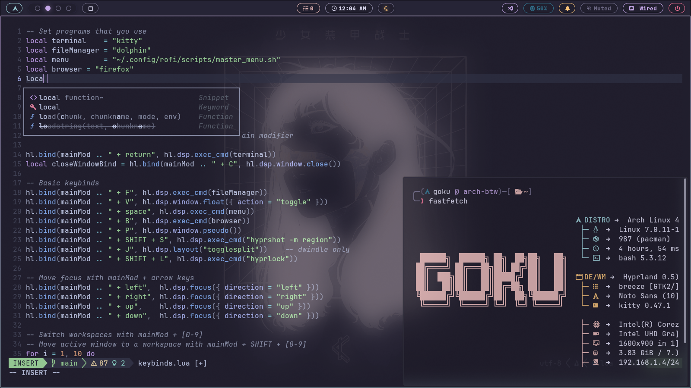

# ⚡ Dotfiles

Welcome to my personal dotfiles repository. This collection contains the configuration files and scripts I use to maintain a sleek, minimalist, and highly functional Linux environment. The setup is built around a modern Wayland compositor and relies on efficient, keyboard-centric tools tailored for development and everyday use.

## Key Components

- **Hyprland** — Dynamic tiling Wayland compositor with smooth animations and modern window management. (https://hyprland.org)
- **Waybar** — Configurable status bar styled with CSS. (https://github.com/Alexays/Waybar)
- **Rofi** — Application launcher and window switcher, themed to match the setup. (https://github.com/davatorium/rofi)
- **SwayNC** — Notification center for Wayland compositors. (https://github.com/ErikReider/SwayNotificationCenter)
- **Wlogout** — Customizable logout menu for Wayland. (https://github.com/ArtsyMacaw/wlogout)
- **Kitty** — GPU-accelerated terminal emulator with config and color schemes. (https://sw.kovidgoyal.net/kitty/)
- **Neovim** (`nvim`) — Primary editor, configured with Lua for a fast editing experience. (https://neovim.io/)
- **Neovim Configs** — LazyVim is a Neovim setup powered by 💤 lazy.nvim to make it easy to customize and extend your config. (https://www.lazyvim.org/)
- **Bash** — Shell configuration, aliases, and helper functions.
- **Fastfetch** — Lightweight system info tool with custom presets. (https://github.com/fastfetch-cli/fastfetch)

## Samples

Here are a few screenshots from `asserts/show-case` showing the current look and feel of the setup.




## Repository Structure

This repo groups configuration by app or service for easy deployment and customization.

```text
.
├── asserts/        # Wallpapers and media assets
│   ├── show-case/  # Example screenshots of the current config
│   └── Wallpapers/ # Curated wallpaper sets
├── bash/           # Bash aliases, profile, and exports
├── fastfetch/      # Fastfetch presets
├── hyprland/       # Hyprland config, rules, autostart scripts
├── kitty/          # Kitty config and color themes
├── local/          # User scripts (install into ~/.local/bin)
├── nvim/           # Neovim Lua configuration
├── rofi/           # Rofi themes and scripts
├── swaync/         # Notification center CSS and layout
├── waybar/         # Waybar modules and CSS
└── wlogout/        # Logout menu layout and assets
```

## Aesthetics & Design

The configurations favor a dark, minimalist aesthetic with subtle glow and accent effects. CSS tweaks for Waybar and SwayNC plus curated wallpapers in `asserts/Wallpapers` help maintain a cohesive look.

## Installation

_Important: Review individual configs before applying them. Back up your existing config files._

1. Clone the repository

```bash
git clone https://github.com/Goku-devil/dot_files.git ~/.dotfiles
cd ~/.dotfiles
```

2a. Manual install (copy specific folders)

```bash
cp -r ~/.dotfiles/hyprland/hypr/ ~/.config/hypr
cp -r ~/.dotfiles/waybar/ ~/.config/waybar
#... and so on ...
```

2b. Install using `stow` (recommended for managing symlinks)

```bash
# from within ~/.dotfiles
stow hyprland
stow waybar
#... so on ...
```

Notes

- The included installation script is experimental — avoid running it unless you inspect and are comfortable with its behavior.
- This setup was tested on Arch Linux; adapt package names and service management for other distros.

## Contributing & Customization

- Tweak CSS and theme files in the `waybar/` and `swaync/` folders.
- Add personal scripts to `local/` and ensure they're executable and in your PATH.
- Open an issue or submit a pull request for suggestions or improvements.

---

Created and maintained by _Goku-devil_
